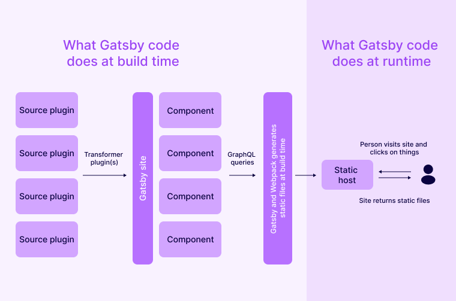
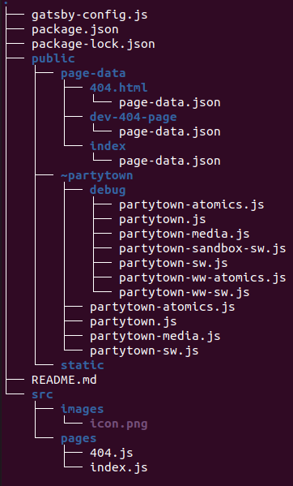

# An Introduction to Gatsby and basic initialization

 

 In this section we'll explain what Gatsby is and how you initialize a Gatsby project. 

### What is Gatsby?

Gatsby is a **static site generator**. Meaning it takes the source files containing both the content and files defining the template to create static HTML files during build. This makes loading faster than for websites that does this creating of HTML, CSS and javascript files dynamically upon user requests.

Static site generators use Markdown files or other text files to store the content. Gatsby expands on this by using MDX which allows you to create UI elements and templates using React and add them to your Markdown files.

Gatsby is also known for using GraphQL for loading data into the react components.



### Prerequisites

Let's start by getting **Node.js** installed. 

1. Install NVM (Node Version Manager):

    ```plain
    curl -o- https://raw.githubusercontent.com/nvm-sh/nvm/v0.39.4/install.sh | bash
    ```{{exec}}

2. Load NVM into the current shell session:

    ```plain
    source ~/.bashrc
    ```{{exec}}

3. Install the latest LTS version of Node.js:

    ```plain
    nvm install --lts
    ```{{exec}}

4. Check that Node.js is installed correctly:

    ```plain
    node -v
    ```{{exec}}

Additionally, let's configure git that should already be installed on the machine:

1. Set your Git email:

    ```plain
    git config --global user.email "gatsby@tutorial.com"
    ```{{exec}}

2. Set your Git username:

    ```plain
    git config --global user.name "Gatsby Gat"
    ```{{exec}}

### Initializing a Gatsby Project

To create a new Gatsby project, follow these steps:

1. Run the following command to initialize a new Gatsby project:

    ```plain
    npm init gatsby -- -y my-gatsby-site
    ```{{exec}}


Once installation is finished, enter the directory of your new Gatsby Project

```plain
cd my-gatsby-site
```{{exec}}

If everything is correct this should be the structure (excluding node_modules). 




Creating another file in the *src/pages* directory creates a new page on your site based on the name of the file.


Congratulations you've set up the template of a Gatsby project!
